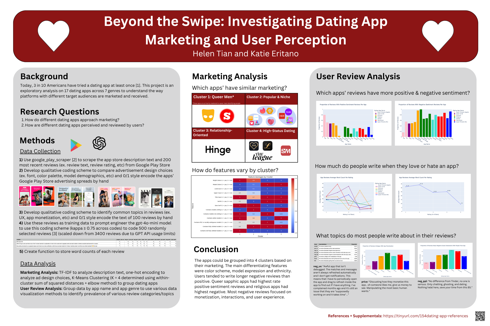
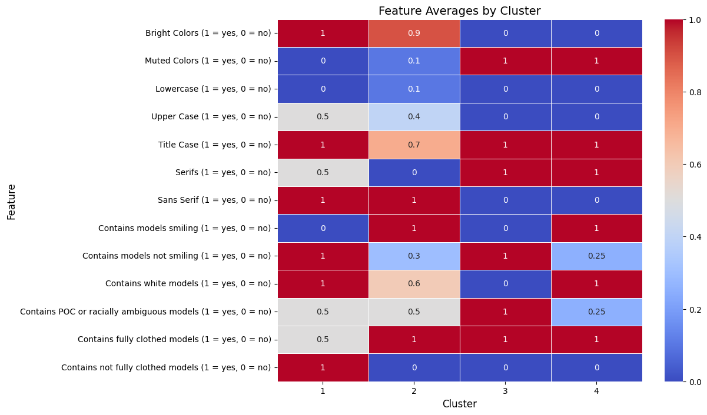
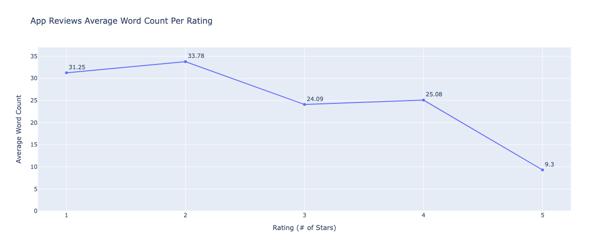
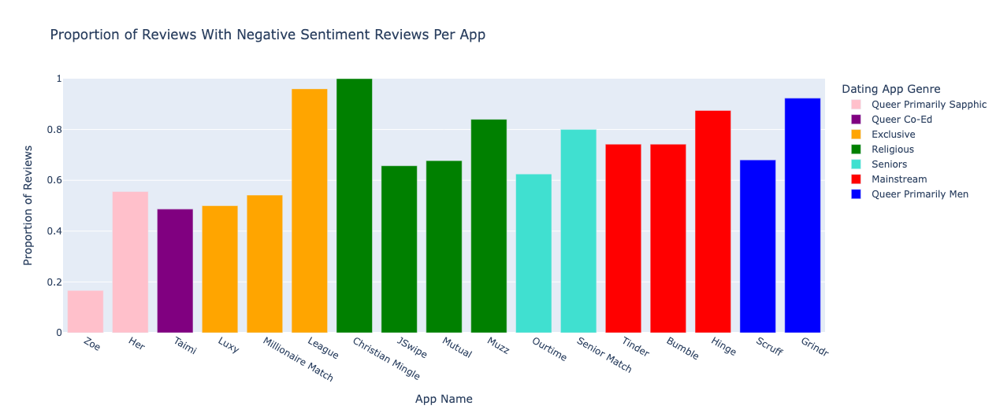
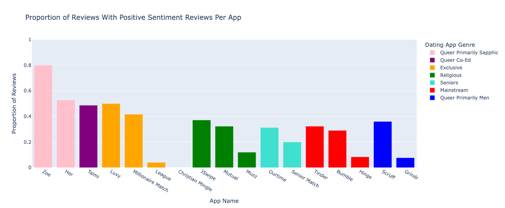
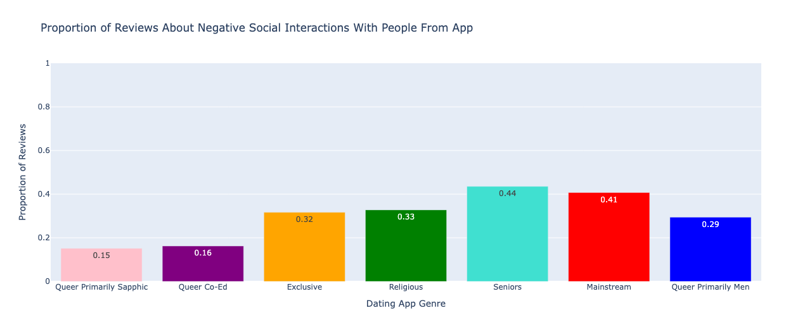
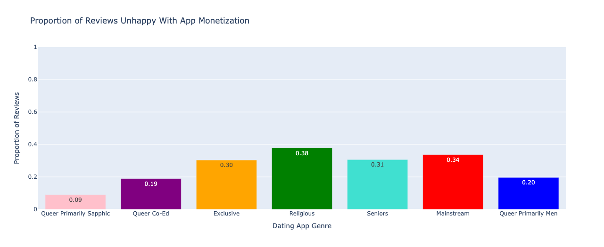

Final project in collaboration with Helen Tian for **DATASCI 112: Principles of Data Science** with Professor Dennis Sun, Winter '25.  
This project explores how different dating apps are marketed and how they are received by users, combining **qualitative coding, clustering, and natural language analysis**.

## Project Overview
Dating apps are now a major way people connect: nearly **3 in 10 Americans have tried one** [1].  
We conducted an **exploratory analysis** of **17 dating apps across 7 categories** to examine:
- How platforms market themselves through visuals and language.
- How users perceive and review these apps on the Google Play Store.

We combined **manual qualitative coding** with **data science methods** (TF-IDF, clustering, prompt-engineered GPT classification) to uncover themes in both marketing and user feedback.

## Research Questions
1. How do different dating apps approach marketing, and how do their strategies compare?  
2. How are dating apps perceived and reviewed by users?  

## Data Collection
1. **Scraping app data**:  
   - Used [`google-play-scraper`](https://pypi.org/project/google-play-scraper/) [2] to collect app descriptions and the **200 most recent reviews** for each app.  

2. **Qualitative coding of marketing materials**:  
   - Manually annotated Google Play Store advertising spreads (e.g., font style, color palette, model ethnicity, model expression, clothing coverage).  

3. **Qualitative coding of reviews**:  
   - Developed a scheme to capture common topics (UX, monetization, community, etc.).  
   - Hand-coded 100 reviews for reliability testing.  

4. **Scaling with GPT**:  
   - Trained GPT-4o-mini [3] with prompt-engineering to apply our coding scheme to 500 reviews (achieving inter-rater reliability κ ≥ 0.75).  

5. **Additional features**:  
   - Word counts for each review.  
   - Download counts and app ratings (as of March 6, 2025).  

## Methods
- **Marketing Analysis**:  
  - TF-IDF on app descriptions.  
  - One-hot encoding on ad design features.  
  - **K-Means clustering** (K = 4, determined via elbow method).  

- **User Review Analysis**:  
  - Grouped reviews by app and app genre.  
  - Data visualizations highlighting distribution of review topics, sentiment, and review length.  

## Results  

Our analysis revealed patterns in both **marketing strategies** and **user experiences** across dating apps.  

### Marketing Clusters  
Apps grouped into four categories based on branding and description text:  
1. **Queer Male Apps**: Grindr, SCRUFF  
2. **General & Niche Apps**: Tinder, Bumble, HER, Zoe, Taimi, Christian Mingle, Muzz, Jswipe, Mutual, Ourtime  
3. **Relationship-Oriented**: Hinge  
4. **Exclusive/High-Status Apps**: Millionaire Match, Luxy, The League, Senior Match  

### Marketing Visuals  
We identified four distinct styles in app store imagery, defined by **color scheme, typography, and model representation**.  

  

- **Cluster 1 – Blended Style**  
  Mix of bright and muted colors; serif and sans-serif fonts. Models not smiling, fully clothed. Balanced representation of white and POC models.  

- **Cluster 2 – Bright & Polished**  
  Bright colors and sans-serif fonts. Models smiling, fully clothed. Predominantly white models.  

- **Cluster 3 – Muted & Serious**  
  Muted tones, serif fonts. Models not smiling, fully clothed. Strong focus on POC models; very few white models.  

- **Cluster 4 – Muted & Provocative**  
  Muted colors and serif fonts. Models smiling but not fully clothed. High proportion of white models, lower representation of POC.  

### User Review Patterns  
Analysis of user feedback revealed consistent trends in **review length, sentiment, and sources of dissatisfaction**.  

#### Review Length and Rating  
- **1–2 star reviews** were much longer (31–34 words on average).  
- **5-star reviews** were very short (≈9 words).  

  

This suggests dissatisfied users write detailed complaints, while satisfied users leave brief praise.  

#### Positive vs. Negative Sentiment  
- **Queer sapphic apps** (e.g., Zoe, Her) had the highest proportion of positive reviews.  
- **Exclusive apps** (e.g., The League) and **Queer male apps** (e.g., Grindr) had the highest negative sentiment.  

  
  

#### Sources of User Unhappiness  

- **Social Interactions:**  
  - Seniors apps → 44% of reviews cite negative social experiences.  
  - Mainstream apps → 41% cite negative social experiences.  
  - Queer sapphic apps → 15% cite negative social experiences.  

  

- **Monetization:**  
  - Religious apps → 38% of reviews cite issues with monetization.  
  - Queer sapphic apps → only 9% of reviews cite monetization issues.  

  

## References:
[1] [Key findings about online dating in the U.S.](https://www.pewresearch.org/short-reads/2023/02/02/key-findings-about-online-dating-in-the-u-s/) (Pew Research Center)

[2] We took inspiration from the [Dating Apps Reviews 2017-2022 (all regions)](https://www.kaggle.com/datasets/sidharthkriplani/datingappreviews) project on Kaggle, which referenced the [google-play-scraper] (https://pypi.org/project/google-play-scraper/)

[3] We used skeleton code from [Rathje et al., 2024](https://www.pnas.org/doi/10.1073/pnas.2308950121) to train GPT on our qualitative coding scheme. Huge thank you to the Stanford SPARQ lab for support in this process.