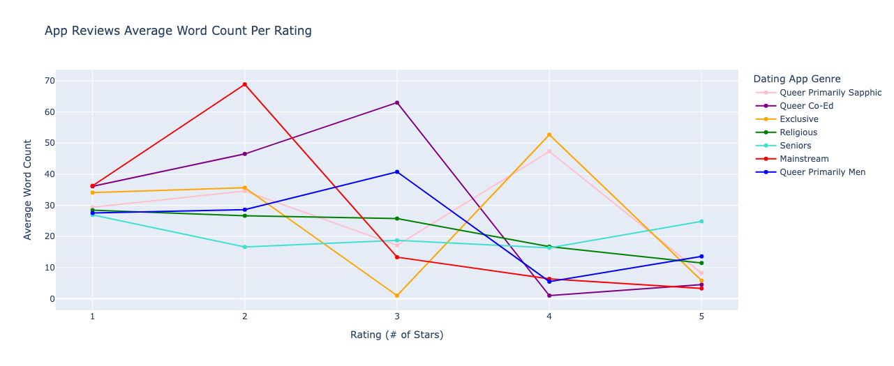

# Key Findings on User Reviews and Sentiment

## Review Length and Star Rating

#### Average Review Length and Rating
The length of a review is a strong indicator of user sentiment.  
- Reviews with **1–2 stars** are significantly longer (31–34 words on average).  
- **5-star reviews** are much shorter (around 9 words).  

This suggests that users with negative experiences are more likely to write detailed, descriptive feedback, while satisfied users tend to leave short, positive reviews.

#### Review Length and Rating by Category

- **Religious apps** and **Senior-focused apps** showed steady, moderately long reviews (≈17–30 words) with little variation across star ratings.  
- **Mainstream apps** and **Queer Co-ed apps** displayed sharp contrasts: reviews for **1–2 stars** were much longer (≈47–69 words) compared to **5-star reviews** (≈3–13 words). Negative feedback was expressed in much greater detail, while positive feedback was short and minimal.  
- **Exclusive apps** (e.g., members-only or curated platforms) had relatively short reviews overall (≈6–18 words), regardless of rating, suggesting concise but not highly detailed feedback.  
- **Queer Sapphic apps** showed a clear split: negative reviews were moderately long (≈25–35 words), while positive reviews were extremely brief (≈2–5 words).  
- **Queer Men’s apps** had a similar but more extreme pattern, with negative reviews (≈50–60 words) far longer than positive reviews (≈3–10 words).  
 

## Negative vs. Positive Sentiment
There is a clear disparity in user sentiment across different app genres:  
- **Queer (Primarily Sapphic) apps** (e.g., Zoe, Her) → highest proportion of positive reviews, lowest negative reviews.  
- **Exclusive apps** (e.g., The League) and **Queer (Primarily Men) apps** (e.g., Grindr) → extremely high proportions of negative sentiment.  

## Sources of User Unhappiness

### Social Interactions
- **Seniors apps** → 44% of reviews mention negative social interactions.  
- **Mainstream apps** → 41% negative social interactions.  
- **Queer (Primarily Sapphic) apps** → much lower, at 15%.  

### Monetization
- **Religious apps** → highest proportion of complaints about monetization (38%).  
- **Queer (Primarily Sapphic) apps** → lowest, at just 9%.  

# Key Findings on Marketing Visuals
Our analysis of marketing visuals revealed distinct patterns across app clusters:

### Cluster 1
- Mix of **bright and muted colors**, serif and sans-serif fonts.  
- Models: not smiling, fully clothed.  
- Representation: both white models and people of color.  

### Cluster 2
- Predominantly **bright colors** and sans-serif fonts.  
- Models: smiling, fully clothed.  
- Representation: many white models.  

### Cluster 3
- Strong use of **muted colors** and serif fonts.  
- Models: not smiling, fully clothed.  
- Representation: few white models, higher focus on people of color.  

### Cluster 4
- **Muted colors** and serif fonts.  
- Models: smiling, **not fully clothed**.  
- Representation: high proportion of white models, low proportion of people of color.  

